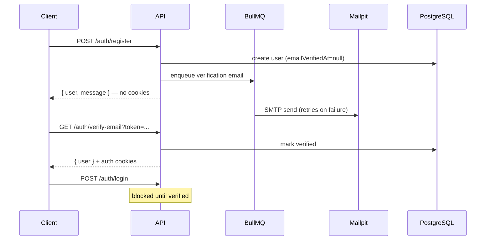

# Unlocked — NestJS + Prisma Boilerplate

A production-ready NestJS boilerplate with Prisma, PostgreSQL, hybrid JWT authentication, and email verification via BullMQ.

## Stack

- **NestJS 11** — API framework
- **Prisma 6** — ORM
- **PostgreSQL** — Database
- **Redis + BullMQ** — Email job queue with retries
- **Nodemailer + Mailpit** — SMTP email delivery (local dev)
- **Passport + JWT** — Access token validation via HttpOnly cookies
- **Swagger** — API docs at `/api`
- **pnpm** — Package manager

## Authentication

Hybrid model: access tokens are stateless JWTs; refresh tokens are JWTs tracked in PostgreSQL (SHA-256 hash) for rotation, revocation, and server-side logout.

| Token | TTL (default) | Delivery | Persistence |
|-------|---------------|----------|-------------|
| Access | 15m | `access_token` HttpOnly cookie | Stateless |
| Refresh | 7d | `refresh_token` HttpOnly cookie | Hashed in `RefreshToken` table |

### Email verification

Registration does **not** log you in. A verification email is queued via BullMQ and must be confirmed before login.



| Step | Behavior |
|------|----------|
| Register | Returns `{ user, message }`; queues verification email |
| Verify | Magic link sets `emailVerifiedAt` and auth cookies |
| Login | Blocked with 403 until email is verified |
| Resend | `POST /auth/resend-verification` re-queues email (rate-limited) |

### Cookie settings

| Cookie | HttpOnly | Secure | SameSite | Expiry |
|--------|----------|--------|----------|--------|
| `access_token` | Yes | production only | Lax | `JWT_ACCESS_EXPIRES_IN` |
| `refresh_token` | Yes | production only | Lax | `JWT_REFRESH_EXPIRES_IN` |

## Prerequisites

- Node.js 22+
- pnpm 10+
- Docker Compose (Postgres, Redis, Mailpit)

## Getting Started

### 1. Install dependencies

```bash
pnpm install
```

### 2. Configure environment

```bash
cp .env.example .env
```

| Variable | Required | Default | Description |
|----------|----------|---------|-------------|
| `DATABASE_URL` | Yes | — | PostgreSQL connection string |
| `APP_URL` | No | `http://localhost:3000` | Base URL for verification links |
| `JWT_ACCESS_SECRET` | Yes | — | Secret for signing access JWTs |
| `JWT_ACCESS_EXPIRES_IN` | No | `15m` | Access token TTL |
| `JWT_REFRESH_SECRET` | Yes | — | Secret for refresh JWTs |
| `JWT_REFRESH_EXPIRES_IN` | No | `7d` | Refresh token TTL |
| `REDIS_HOST` | No | `localhost` | BullMQ Redis host |
| `REDIS_PORT` | No | `6379` | BullMQ Redis port |
| `SMTP_HOST` | No | `localhost` | SMTP server (Mailpit in dev) |
| `SMTP_PORT` | No | `1025` | SMTP port |
| `SMTP_FROM` | No | `noreply@unlocked.local` | From address |
| `EMAIL_VERIFICATION_EXPIRES_IN` | No | `24h` | Verification link TTL |
| `EMAIL_VERIFICATION_RESEND_COOLDOWN_SECONDS` | No | `60` | Min seconds between resends |
| `PORT` | No | `3000` | Server port |

### 3. Start infrastructure

```bash
docker compose up -d
```

Services: Postgres (`5432`), Redis (`6379`), Mailpit SMTP (`1025`) + UI (`8025`).

### 4. Run migrations

```bash
pnpm prisma:migrate:dev
pnpm prisma:generate
```

### 5. Start the server

```bash
pnpm run start:dev
```

- API: `http://localhost:3000`
- Swagger: `http://localhost:3000/api`
- Mailpit UI: `http://localhost:8025`

## API Endpoints

| Method | Route | Auth | Description |
|--------|-------|------|-------------|
| GET | `/` | Public | Health check |
| POST | `/auth/register` | Public | Register; queues verification email |
| GET | `/auth/verify-email?token=` | Public | Verify email; sets auth cookies |
| POST | `/auth/resend-verification` | Public | Resend verification email |
| POST | `/auth/login` | Public | Login (requires verified email) |
| POST | `/auth/refresh` | Refresh cookie | Rotate tokens |
| POST | `/auth/logout` | Refresh cookie | Revoke refresh token; clear cookies |
| GET | `/auth/me` | Access cookie or Bearer | Current user profile |

### Register response

```json
{
  "user": {
    "id": "clxyz123abc",
    "email": "user@example.com",
    "emailVerifiedAt": null
  },
  "message": "Registration successful. Please check your email to verify your account."
}
```

## Project Structure

```
src/
├── modules/
│   ├── auth/
│   │   ├── dto/
│   │   ├── strategies/
│   │   ├── types/
│   │   ├── email-verification.service.ts
│   │   ├── auth-cookies.ts
│   │   ├── auth.controller.ts
│   │   ├── auth.service.ts
│   │   └── auth.module.ts
│   ├── mail/
│   │   ├── templates/verification.email.ts
│   │   ├── types/
│   │   ├── mail.service.ts
│   │   ├── mail.processor.ts
│   │   ├── mail-queue.service.ts
│   │   └── mail.module.ts
│   └── prisma/
├── common/
├── config/
└── main.ts
prisma/
├── schema.prisma
└── migrations/
```

## Protecting routes

```typescript
@Get('profile')
@UseGuards(JwtAuthGuard)
getProfile(@CurrentUser() user: SafeUser) {
  return user;
}
```

## Scripts

| Script | Description |
|--------|-------------|
| `pnpm run start:dev` | Start in watch mode |
| `pnpm run build` | Build for production |
| `pnpm run test:e2e` | Run end-to-end tests |
| `pnpm prisma:migrate:dev` | Create/apply migrations (dev) |
| `pnpm prisma:migrate:deploy` | Deploy migrations (prod) |
| `pnpm prisma:generate` | Regenerate Prisma Client |
| `pnpm prisma:studio` | Open Prisma Studio |

## Testing

```bash
pnpm run test:e2e
```

E2e tests mock the mail queue (no Redis/Mailpit required in CI). All auth flows including verification, resend, login block, refresh, and logout are covered.

## Manual verification flow

1. `docker compose up -d`
2. `pnpm run start:dev`
3. Register via Swagger or curl
4. Open Mailpit at `http://localhost:8025`
5. Click the verification link
6. Login succeeds with verified account
